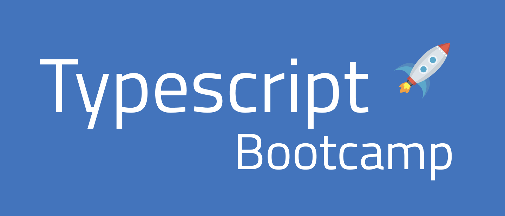

# 🚀 TypeScript Bootcamp 🚀
<so-cut label="[Code]"> code </so-cut >
## 🧩 1a Skapa ett nytt npm-projekt. 
Installera TypeScript med npm typescript . Skapa konfigurationsfil med tsc --init . Du ska kunna skriva package.json-skript som kör "tsc" i terminalen.
Målet är att kunna omvandla en TypeScript-fil till vanlig JavaScript.

### 🧩 1b Skapa en config-fil för TypeScript. 
Ställ in outDir så att js-filer läggs i en mapp med namnet dist/. Skriv ett skript som kör tsc.
>! Tips: npm init -y, npm i -D typescript, npx tsc --init 

### 🧩 1c Skapa filen "src/script.ts" och gör ett skript som kör "dist/script.js". 
Skriv in:
let x: string = 42;
Vad händer? Ta reda på vad felmeddelandet betyder och lös det.

### 🧩 1d Deklarera variabler med olika datatyper
Skapa tre variabler av typen `string`, `number` och `boolean`. Tilldela dem lämpliga värden.

---

## 🧩 2. Läs Documentation - TypeScript for JavaScript Programmers och svara på frågorna.
a Vad betyder (type) inference?
b Vad är ett interface? 
c Vilka datatyper har JavaScript?
d Vilka nya datatyper tillför TypeScript?
e Vad är generics?

---

## 🧩 3. Skriv en funktion som summerar två tal
Skapa en funktion `sum` som tar två `number`-argument och returnerar deras summa.

---

## 🧩 4. Kontrollera om ett tal är udda eller jämnt
Skriv en funktion `isEven` som returnerar `true` om ett tal är jämnt och `false` om det är udda.

---

## 🧩 5. Typdeklarera en array
Skapa en variabel `numbers` av typen `number[]` och fyll den med minst tre tal.

---

## 🧩 6. Filtrera jämna tal från en array
Skriv en funktion `filterEvenNumbers` som tar en array av `number[]` och returnerar bara de jämna talen.

---

## 🧩 7. Hantera en unionstyp
Skapa en funktion `describeValue` som tar ett argument som kan vara antingen `string` eller `number` och returnerar en strängbeskrivning av värdet.

---

## 🧩 8. En enkel typalias
Skapa ett typalias `Person` som innehåller ett namn (`name: string`) och ålder (`age: number`). Skapa en variabel av den typen.

---

## 🧩 9. Objekt som funktionens argument
Skriv en funktion `printPersonInfo` som tar ett objekt av typen `Person` och skriver ut namn och ålder.

---

## 🧩 10. Enum-övning
Definiera en `enum` för veckodagar och skriv en funktion `isWeekend` som returnerar `true` för helgdagar.

---

## 🧩 11. Kontrollera längden på en sträng
Skriv en funktion `isLongString` som returnerar `true` om en sträng har mer än 10 tecken.

---

## 🧩 12. Sortera en array av tal
Skriv en funktion `sortNumbers` som tar en array av `number[]` och returnerar den sorterad i stigande ordning.

---

## 🧩 13. En enkel tuple
Skapa en tuple `coordinate` som innehåller två värden: latitud och longitud (`number` båda). Skriv ut värdena.

---

## 🧩 14. Typvakt med `typeof`
Skriv en funktion `isString` som returnerar `true` om argumentet är en sträng och `false` annars.

---

## 🧩 15. Omvandla array till sträng
Skriv en funktion `joinStrings` som tar en array av `string[]` och returnerar en enda sammanslagen sträng.

---

## 🧩 16. Defaultvärde i en funktion
Skapa en funktion `greet` som tar ett valfritt namn och returnerar `"Hello, Guest"` om inget namn ges.

---

## 🧩 17. Returnera en funktion
Skriv en funktion `createMultiplier` som tar ett tal som argument och returnerar en funktion som multiplicerar sina argument med det talet.

---

## 🧩 18. Hantera `null` och `undefined`
Skriv en funktion `printValue` som skriver ut värdet om det inte är `null` eller `undefined`. Skriv `"No value"` annars.

---

## 🧩 19. Skapa en enkel interface
Definiera ett `interface` för ett `Book`-objekt med `title`, `author` och `year`. Skapa ett objekt som följer interfacet.

---

## 🧩 20. Implementera logik med if/else
Skriv en funktion `gradeEvaluator` som returnerar `"Pass"` om betyget är minst 50 och `"Fail"` annars.

---

## 🧩 21. Rekursion: räkna ner
Skapa en funktion `countdown` som tar ett heltal och skriver ut en nedräkning till noll.

---

## 🧩 22. Skapa en variabel color som innehåller namnet på ett färg. 
Skriv en funktion som producerar en mening med variabeln. Om color till exempel är 'blå' ska programmet skriva ut: 'En blå bil'. Variabeln och funktionen ska ha type annotations; dvs du ska tala om vilka datatyper variabeln, parametern och returvärdet har.

---

## 🧩 23. Skriv en loop som kör 10 gånger. 
Du kan lägga den i en funktion för att få bättre struktur på koden. Loopen ska simulera ett trafikljus och därför omväxlande skriva ut "rött", "gult", "grönt" i den ordningen. En färg per varv i loopen.
>! Tips: du behöver en till variabel, som håller ordning på om det är 1, 2 eller 3 som ska skrivas ut.

## 🧩 24. Skriv ett program som skriver ut talen 1 till 20 och om varje tal är udda eller jämnt.
Tips 1: Du kan använda en variabel för att hålla reda på om variabeln är jämn. let isEven = true 
Tips 2: Operatorn modulo kan användas för att ta reda på om ett tal är udda eller jämnt.
>! if( x % 2 === 0 ) { /* talet är jämnt */ }

